# 使用CloudEndure将虚拟机从阿里云迁移至AWS

因为客户应用系统配置较复杂，希望能够将虚拟机直接进行迁移，而不是重新进行部署和配置。在上一篇文章中（[使用手工方式将虚拟机从阿里云迁移至AWS]()）， 我们通过dd命令进行手工迁移，有些客户会觉得这样还是比较繁琐，希望有工具或服务来完成迁移工作，本文将介绍使用CloudEndure将虚拟机从阿里云上迁移至AWS。

1. CloudEndure工作过程如下图所示。

​                             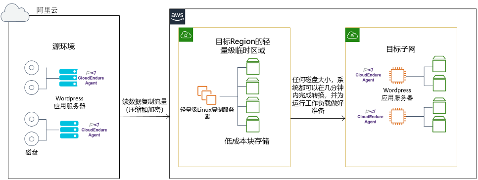

Figure 1.     使用CloudEndure复制虚拟机

 

在该过程中：

1)  在Marketplace订阅Cloudendure，打开https://aws.amazon.com/marketplace/pp/B01MQCH96B 进行订阅，并按照提示完成Cloudendure 注册。

2)  创建项目：

使用注册的帐户登录到Cloudendure Console: https://console.cloudendure.com

点击创建项目，填填写项目名称、类型选择Migration，并创建。

在下一步的Setup & Info中的AWS CREDENTIALS tab页中填入AWS的AK/SK访问凭据。

接下来在REPLICATION SETTINGS中：

Ø 设置Migration Source为Other Infrastructure，Migration Target为AWS Northern Virginiar。

Ø 在Replication Servers里选择机型类型，如果需要复制的数量量较大，可适当选择稍大一些的机型。

Ø 选择subnet-ext作为Replication Servers部署的子网

Ø 配置CloudEndure agent通过VPN连接到Replication Servers。

如下图所示，选择保存。

 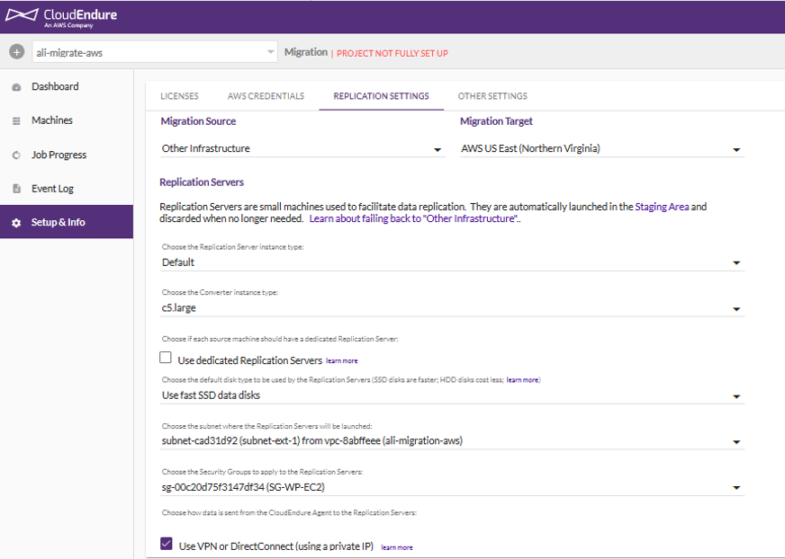

Figure 2.     配置REPLICATION SETTINGS

 

2. 安装Agent，点击左侧Machine按钮，来获取Agent安装信息。

 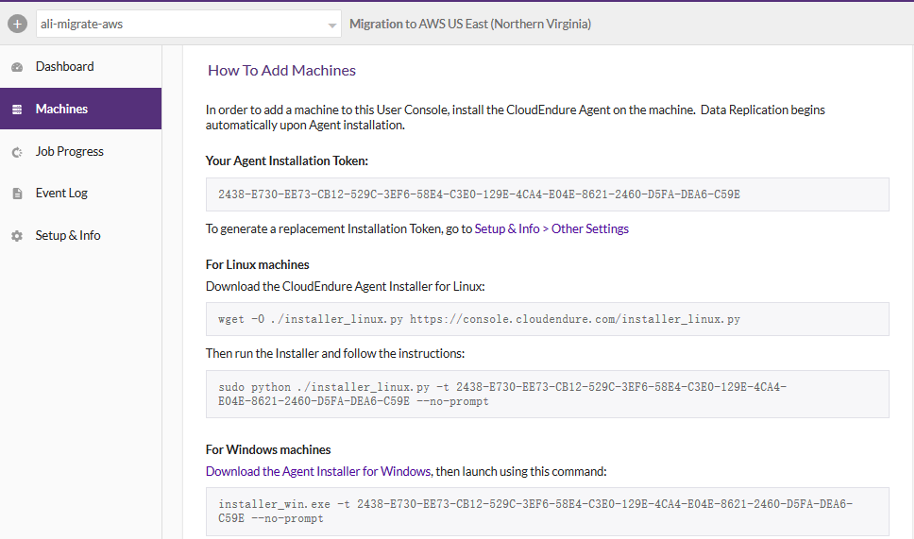

Figure 3.     安装Agent

 

在阿里云的wordpress虚拟机上运行命令：

wget -O ./installer_linux.py https://console.cloudendure.com/installer_linux.py

sudo python ./installer_linux.py -t 2438-E730-EE73-CB12-529C-3EF6-58E4-C3E0-129E-4CA4-E04E-8621-2460-D5FA-DEA6-C59E --no-prompt

如果看到下面的输出，则说明安装成功。

 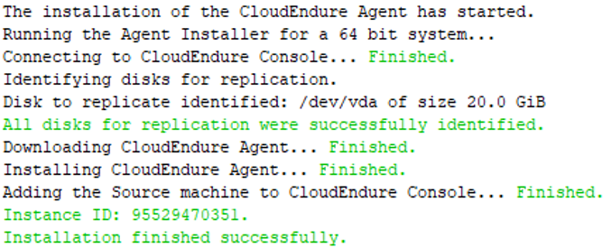

Figure 4.     成功安装Agent的输出

 

3. Agent安装完成后，要复制的内容会出现在控制台上。需要等待任务初始化，并创建Replication Server EC2实例后，复制将会自动开始。如下图所示。预计完成复制的时间由当前在阿里云上的OpenSwan虚拟机到internet的网络带宽（该带宽如果使用了弹性IP，则带宽最高可以增加到200Mb/s，并且不需要重启实例）、AWS平台上的复制实例的类型等决定。

 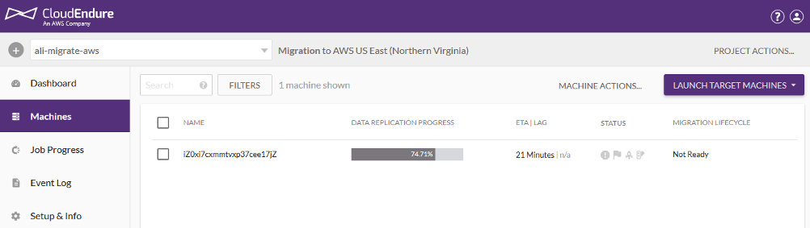

Figure 5.     成功安装Agent的输出

 

4.  双击该虚拟机，进行Blueprint的设置，也就是为该实例在AWS上的EC2实例配置信息，如实例类型、网络配置等等。对我们这里的项目来说，该EC2实例部署在subnet-ext网络中，并指定实例类型为c5.large。确定以后，选择保存。如下图所示：

 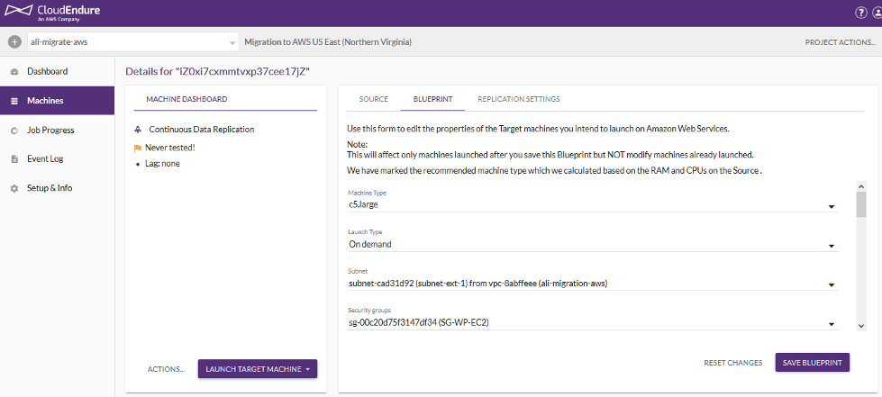

Figure 6.     设置BLUEPRINT

 

5.  当被复制的虚拟机的状态变为Continuous Data Replication，则完成存量数据的复制，进入变更复制阶段。此时可以启动EC2进行测试。在此阶段，需要确认迁移过后的EC2所必需的调整和配置，如：部分软件的升级、yum source、应用的重新配置等内容，并对最终的切换流程进行确认。如下图所示：

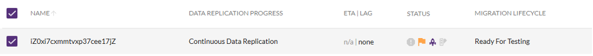 

Figure 7.     虚拟机复制状态

 

在菜单选择Test Mode，即可执行对虚拟机的转换并创建EC2实例。

 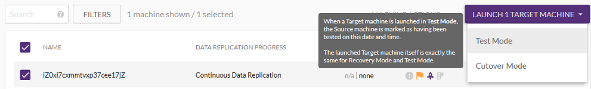

Figure 8.     运行Test Mode

 

可以点击右侧的Job Progress观察任务的进度。

 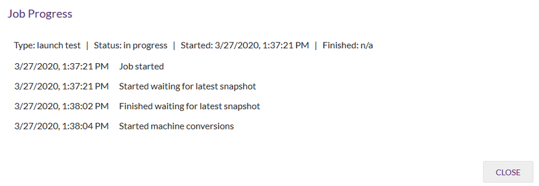Figure 9.     Test Mode任务运行状态

 在EC2 Console中可以看到创建好的EC2实例。并且可以用阿里云上的用户名和key进行登录。

 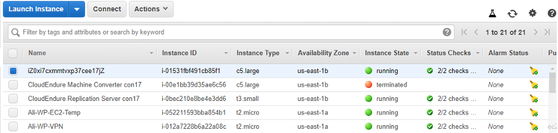

Figure 10.   在EC2 Console上确认创建好的EC2实例

 

6.  当测试完毕，就可以进行系统切换，按照在测试阶段制订好的切换计划和流程进行。比如：

1) 停止阿里云上的生产环境

2) 在CloudEndure Console上点击Cutover

 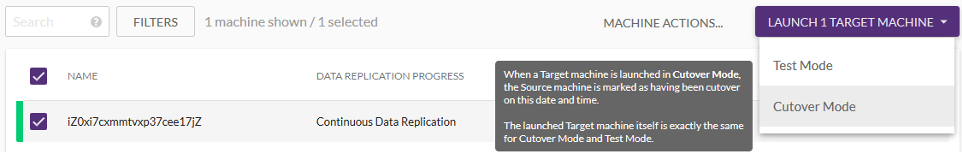

Figure 11.   运行Cutover Mode

 

3) 对启动后的EC2实例进行必要的设置和调整，如：数据库RDS域名的变更等。具体参考迁移步骤中的最后一步：系统割接及验证。