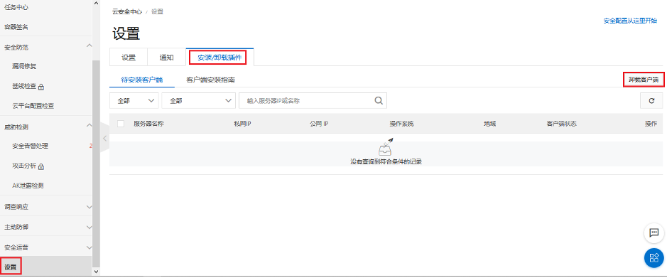
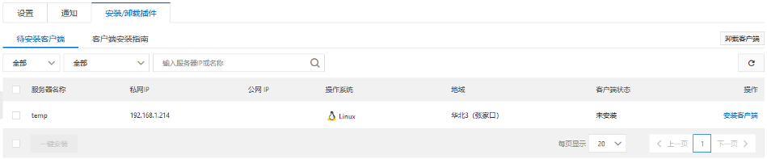
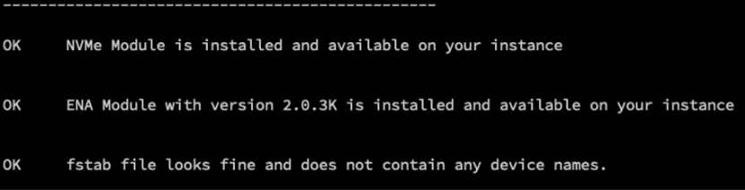

# 使用手工方式将虚拟机从阿里云迁移至AWS


因为客户应用系统配置较复杂，希望能够将虚拟机直接进行迁移，而不是重新进行部署和配置。该迁移方法主要采用dd工具，将位于阿里云上的虚拟机启动卷写入至文件，并在AWS云上进重新写入至EBS卷，配置好相应的驱动及配置即可运行。

客户在阿里云上使用的操作系统为CentOS 7.5，其他系统过程类似。

迁移步骤如下：

1). 修改源虚拟机网络配置

```
	vi /etc/sysconfig/network-scripts/ifcfg-eth0
	
	添加如下内容：

  DEVICE=eth0
  BOOTPROTO=dhcp
  ONBOOT=yes
  TYPE=Ethernet
  USERCTL=yes
  PEERDNS=yes
  DHCPV6C=yes
  DHCPV6C_OPTIONS=-nw
  PERSISTENT_DHCLIENT=yes
  RES_OPTIONS="timeout:2 attempts:5"
  DHCP_ARP_CHECK=no
```


2)  卸载阿里云安骑士：

登录云盾服务器安全（安骑士）管理控制台，单击左侧导航栏设置 > 安装/卸载 。如下图所示。

                               

Figure 1.     阿里云虚拟机上卸载云盾

 

2)  选择卸载客户端，直至未安装安骑士的虚拟机出现在列表中。如下图所示。

 

Figure 2.     阿里云虚拟机上卸载云盾

 

3)  检查fstab文件，查看是否有挂载其他卷。

4)  更新软件包及YUM源设置：

​	本步骤也可以在AWS启动后进行，这样可以做到对源系统零影响

​	由于阿里云上虚拟机的yum源只能够在阿里云内访问，因此需要将源改至其他公开的地址，如网易163镜像。

```
yum update -y   //进行软件更新
mv /etc/yum.repos.d/CentOS-Base.repo /etc/yum.repos.d/CentOS-Base.repo_bak //备份原yum repo文件
yum remove epel-release    //卸载阿里版的epel-release
wget -O /etc/yum.repos.d/CentOS-Base.repo http://mirrors.163.com/.help/CentOS7-Base-163.repo
yum makecache  //添加网易yum源

```

5)  下载并运行AWS 5系检查脚本：

由于AWS最新系列的虚拟机均采用Nitro技术构建和运行，以获得近似于物理机的性能。因此需要具备增强网络驱动和NVME驱动程序，并加载至内核。

我们可以下载检查工具，来确保当前系统满足Nitro的运行需求：

```
wget https://raw.githubusercontent.com/awslabs/aws-support-tools/master/EC2/NitroInstanceChecks/nitro_check_script.sh
chmod +x nitro_check_script.sh
./nitro_check_script.sh
```

从CentOS 7.1版本后，已经内置了由Amazon提供的增强网络驱动和NVME驱动程序，大多数情况可直接通过检查。如下图所示则说明检查通过。



Figure 3.     确认ENA驱动成功安装


如遇到以下问题，解决方法如下（也可以在虚拟迁移至AWS之后，先使用4系列或T2系列，待问题解决后再切换至5系列即可）：

- 无ENA驱动，参考此文章进行安装：https://aws.amazon.com/cn/premiumsupport/knowledge-center/install-ena-driver-rhel-ec2/

- NVME驱动未加载：

  ```
  echo 'add_drivers+=" nvme "' > /etc/dracut.conf.d/nvme.conf
  dracut -f -v
  ```

6)  将阿里云虚拟机启动卷写入文件

6.1) 在阿里云创建新卷并挂载至虚拟机，用于存储

6.2) 为新卷创建文件系统：

```
mkfs -t ext4 /dev/vdb
```

6.3) 挂载至虚拟机

```
mount /dev/vdb /mnt
```

6.4) 用dd命令把根卷（假设应用系统安装在根卷）写入文件：

```
dd if=/dev/vda of=/mnt/centos.bin bs=100M
```

 7)  将centos.bin传输到AWS的S3上，为了节约带宽和流量，可以先压缩再上传。

```
安装aws cli命令行，使用命令进行配置
$> aws configure    //运行aws cli配置
$> aws s3 cp centos.bin s3://yourbucket/centos.bin    //上传至s3
```

8)  将centos.bin文件写入目标EBS根卷

8.1) 首先在AWS创建一台用户写入EBS卷的EC2虚拟机，同时创建并挂载一个EBS卷用于写入，容量不小于阿里云虚拟机的启动卷。

8.2) 从s3下载centos.bin文件，执行dd命令，把centos.bin文件写入EBS根卷（假设是/dev/xvdg）

```
aws s3 cp s3://yourbucket/centos.bin ./centos.bin
dd if=centos.bin of=/dev/xvdg bs=1M oflag=direct
umount /dev/xvdg
```

9)  在写入的EBS卷创建快照，并使用该快照来创建AMI镜像

10) 使用创建的AMI镜像启动虚拟机，部署在私有子网里。可使用原用户名以及key文件进行登录。


